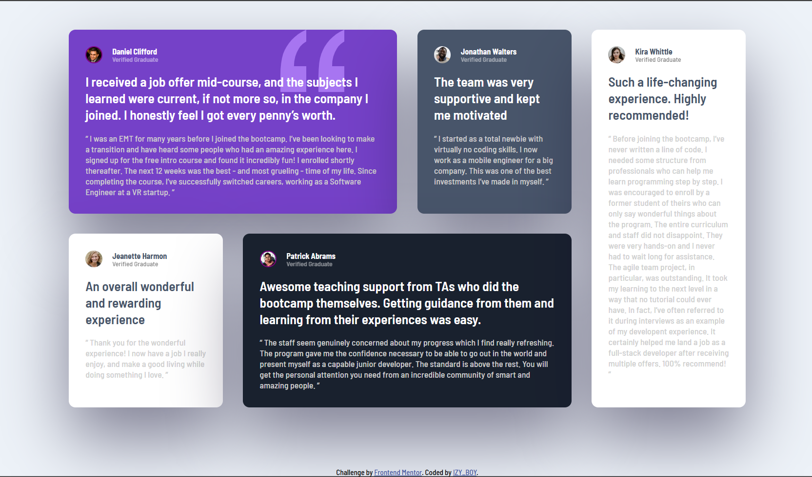

# Frontend Mentor - Testimonial Grid solution

Frontend Mentor challenges help you improve your coding skills by building realistic projects. 

## Table of contents

  - [Screenshot](#screenshot)
  - [Links](#links)
  - [Built with](#built-with)
- [Author](#author)

### Screenshot

### Links

- Solution URL: (https://github.com/IZY-BOY/TestimonialGridChallenge.git)
- Live Site URL: (https://izy-boy.github.io/TestimonialGridChallenge/)

### Built with

- Semantic HTML5 markup
- CSS custom properties
- CSS Grid

## Author

- Frontend Mentor - [@yourusername](https://www.frontendmentor.io/profile/IZY-BOY)
